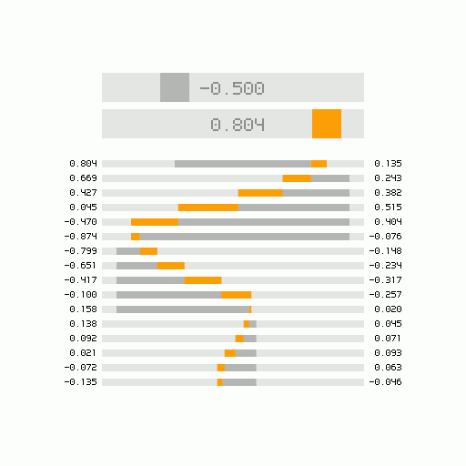

# Everyday One Motion - 20160211 "Critically Damped Spring Smoothing"



Processing

[Everyday One Motion](http://motions.work/motion/98)  

## Critically Damped Spring Smoothing

今回も技術っぽい感じ。  
私が尊敬する[Keijiro TakahashiさんがUnityで実装されていた](http://radiumsoftware.tumblr.com/post/137001869724)「Critically Damped Spring Smoothing」というもので遊んでみました。  
説明について、自分は数学・物理にわかのため、間違っていたりいろいろするかもしれませんが、ご了承ください。。。  

### Smoothing

ある数からある数へ、値を滑らかに変化させる手法は多く存在します。  
自分がこれまで頻繁に利用していた手法は  
```
current += ( target - current ) * k;
// where k is the smoothing factor, 0.0 < k < 1.0
```
というプログラムで実現できるものでした。どうやらこの手法はExponential Smoothingというようです。[（参照）](https://en.wikipedia.org/wiki/Exponential_smoothing)  
しかしこの手法では、目標点を変えた瞬間に、速度の急激な変化が発生してしまい、あまり自然な見た目とはなりませんでした。  

### Damped Spring

通常、ばねは抵抗を与えないと、減衰せずに振動を続けます。  
しかし現実世界では、振動のための運動エネルギーは熱や音などに失われてしまうので、振動は徐々に減衰していきます。  
ここで、ばねに取り付ける質点の質量を `m` 、減衰係数（減衰の強さ）を `c` 、ばね定数（ばねの強さ）を `k` としたとき、減衰比というものが、 `zeta = c / ( 2 * sqrt( mk )` で求められます。  
ここで、減衰比をちょうどよく1に設定した時、ばねは振動せずに減衰していきます。これを臨界減衰 (Critically Damping) といいます。  
減衰比がこれより低いと、不足減衰 (underdamping) といい、振動してしまいます。逆に高いと、過減衰 (overdamping) といい、振動はしないものの収束に時間がかかってしまいます。

### Smoothing

今回は、質点の質量を1とし、数式を超単純化しました。現在位置を `pos` 、 速度を `vel` 、 目標位置を `target` 、 ばね定数を `k` としたとき、Critial Damped Spring Smoothingは以下のプログラムで表現できます。
```
vel += ( -k * ( pos - target ) - 2.0 * vel * sqrt( k ) ) / frameRate;
pos += vel / frameRate;
```
Exponential Smoothingと比較すると、保存しておくべき変数として `vel` が増え、コードも少し面倒になりますが、その分非常に自然なスムージングができますね。  
また、 `2.0 * vel * sqrt( k )` に対して定数を掛けると、減衰比をいじって遊べます。
